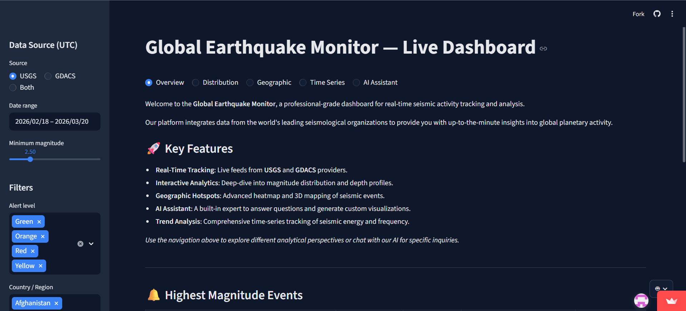

A high-performance, real-time **data science dashboard** built with **Streamlit** that monitors global earthquake activity by aggregating and normalizing data from multiple sources: **USGS Earthquake Catalog** and **GDACS (Global Disaster Alert and Coordination System)**.

The application uses a **strategy-based provider architecture** to fetch data in parallel, ensures long-term persistence with a **local cache**, and presents interactive, theme-consistent visualizations powered by **Plotly**.

---

## 🔗 Live Demo

👉 **[https://global-earthquake-live-monitor.streamlit.app](https://global-earthquake-live-monitor.streamlit.app)**

---

## 📸 Dashboard Preview



*Interactive dashboard showing daily earthquake trends, magnitude distributions, alert level breakdowns, depth analysis, and geographic mapping.*

---

## 🚀 Quick Start (Recommended: Docker)

Testing and deploying the application is easiest using **Docker**:

1. **Clone and Build**
   ```bash
   git clone https://github.com/nadeemtsf/global-earthquake-monitor.git
   cd global-earthquake-monitor
   docker-compose up --build
   ```

2. **Access the Dashboard** at `http://localhost:8501`

### Or Run Locally with Python

1. **Install dependencies**
   ```bash
   pip install -r requirements.txt
   ```

2. **Run the application**
   ```bash
   streamlit run src/app.py
   ```

---

## 🧭 Migration Architecture

The repository is currently transitioning from a single Streamlit app to a monorepo with a FastAPI backend and React frontend.

- Target structure and migration boundaries are documented in [docs/MIGRATION_ARCHITECTURE.md](docs/MIGRATION_ARCHITECTURE.md).
- Streamlit remains temporary during migration for feature-parity validation only.
- The final target structure separates `backend/`, `frontend/`, `transforms/`, and shared docs.

Important: the `transforms/` directory contains the XSLT stylesheets used by the backend canonicalization pipeline and is a MANDATORY graded deliverable. See [transforms/README.md](transforms/README.md) for architecture, samples, and usage instructions.

---

## 📊 Key Features

### 📡 Multi-Provider Data Pipeline
- **Parallel Fetching** — Uses `ThreadPoolExecutor` to fetch data from **USGS** and **GDACS** simultaneously, significantly reducing load times.
- **Provider Architecture** — Modular design (Strategy Pattern) for data providers, making it easy to add new seismic sources.
- **Historical data access** — Select any date range (days, months, or years back).
- **Network Resilience** — Automatic fallback to a persistent **local `.cache/` directory** if upstream APIs are unreachable.

### 📥 Export & Reporting
- Raw **QuakeML XML** and GDACS XML files are exported on every fetch (ideal for downstream XSLT pipelines).
- **Situation Reports** — One-click generation of professional PDF summaries containing KPIs, top events, and natively-rendered visualizations.

### 🤖 Seismic AI Assistant
- Integrated AI chat assistant (powered by Google Gemini) floating on the dashboard.
- Context-aware responses that can analyze the currently filtered earthquake data and answer specific questions about ongoing seismic events.

### 🧩 Data Science & Processing
- **Schema Normalization** — Consistent data schema across differing providers (GeoJSON vs RSS/XML).
- **Alert Classification** — Standardized alert level logic (🔴 ≥7.0, 🟠 ≥5.5, 🟡 ≥4.5).
- **Region Extraction** — Automated parsing of country and region tags from unstructured location strings.
- **Tsunami Flags** — Integrated warnings and specialized map styling for tsunami-prone events.

### 📈 Interactive Dashboard
- **Plotly Visualizations** — 100% interactive charts (Bar, Pie, Boxplot, Scatter, Line) with custom hover tooltips and consistent dark-theme styling.
- **Dynamic Map (Pydeck)** — High-performance scatterplot map with radius scaling and alert-level color coding.
- **Real-time Filters** — Instantly filter by date, magnitude, region, and alert level.

---


## 🌐 Data Sources

1. **USGS Earthquake Catalog** — [fdsnws/event/1/](https://earthquake.usgs.gov/fdsnws/event/1/) (GeoJSON/QuakeML)
2. **GDACS RSS Feed** — [Global Disaster Alert System](https://www.gdacs.org/) (RSS/XML)

---

## 🛠️ Technical Highlights

### Performance & Scalability
- **Multithreading**: Parallelizing API requests for a more responsive user experience.
- **Dockerization**: Consistent development environment using `python:3.11-slim`.
- **Streamlit Caching**: Optimized `@st.cache_data` decorators to minimize redundant processing.

### Quality Assurance
- **Linting**: Enforced code quality with `ruff`.
- **Testing**: Comprehensive `pytest` suite for core utilities and data parsers.
- **Persistence**: Decoupled cache from system temp to ensure network resilience across reboots.
- **Secret Hygiene**: Tokens and API keys must be provided through environment variables or platform secrets, never committed to the repository.

---

## 🔐 Secrets and Issue Automation

This repository must not store plaintext credentials in tracked files.

- Use environment variables or deployment secrets for all tokens and API keys.
- `GOOGLE_API_KEY` is read from Streamlit secrets or the process environment.
- `create_issues.py` reads `GITHUB_TOKEN` from the environment when syncing GitHub issues.

Example PowerShell usage:

```powershell
$env:GITHUB_TOKEN = "<your_github_token>"
python create_issues.py
```

Example Bash usage:

```bash
export GITHUB_TOKEN="<your_github_token>"
python create_issues.py
```

If a token was ever committed, revoke it immediately and replace it with a new one before continuing development.

---

## 📈 Data Science Concepts Demonstrated

- **Data ingestion** from external APIs (REST/JSON + XML)
- **XML export** for XSLT transformation pipelines
- **Data cleaning** and type conversion (epoch timestamps, numeric coercion)
- **Feature engineering** (alert level derivation from magnitude, country extraction from place strings)
- **Time-series analysis** (daily aggregates, rolling averages, cumulative sums)
- **Exploratory data analysis** (distributions, depth vs magnitude scatter, geographic patterns)
- **Interactive visualization** (filters, multi-chart dashboards, map rendering)
- **Automated reporting** (dynamic PDF generation and visual rendering)
- **LLM Integration** (contextual data analysis using Generative AI)

---

## 📝 License

This project is licensed. See the `LICENSE` file for details.

Unless stated otherwise by the author, all rights are reserved.
If you want to reuse or redistribute any part of this repository, please
contact the author first for permission.

---

## 🙋 Author

**Nadim Baboun**  
🔗 [GitHub Profile](https://github.com/nadeemtsf)
