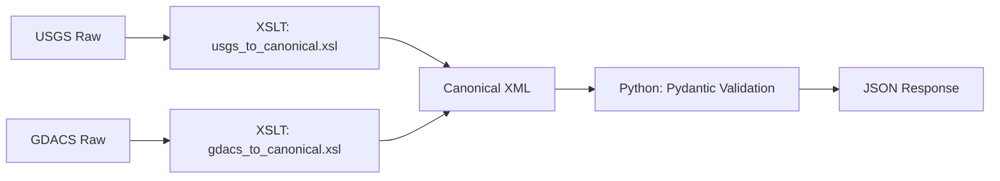

# API Canonical Field Mapping

This document provides the source-of-truth mapping between the **canonical XML representation** (produced by the XSLT pipeline in `transforms/`) and the **JSON response models** (defined in `backend/app/schemas/`) used by the React frontend.

## 1. Top-Level Principles

1.  **Intermediate Format**: The backend fetches raw XML/RSS, transforms it into a canonical XML schema (USGS-like QuakeML extensions), and then serializes that into the JSON models.
2.  **Field Naming**: The backend follows conventional Python/JSON `snake_case` instead of camelCase to align with standard Pydantic practices.
3.  **Required vs. Optional**: All coordinates and magnitudes are required. Extended fields from a specific source (e.g., GDACS-only population) are optional and provided when available.

---

## 2. Canonical Earthquake Fields

The `EarthquakeEvent` schema in the backend represents the final serialized form of a single seismic event.

| JSON Field | Canonical XML Source (XPath-ish) | Type | Description |
| :--- | :--- | :--- | :--- |
| `id` | `event/@publicID` or `link` | `string` | Unique identifier. |
| `title` | `description/text` | `string` | Human-readable event description. |
| `main_time` | `origin/time/value` | `datetime` | UTC timestamp of origin. |
| `magnitude` | `magnitude/mag/value` | `float` | Richter magnitude. |
| `magnitude_type` | `magnitude/type` | `string` | Scale used (e.g., Mw, Ml). |
| `depth_km` | `origin/depth/value` | `float?` | Depth in kilometers. |
| `latitude` | `origin/latitude/value` | `float` | WGS84 Latitude. |
| `longitude` | `origin/longitude/value` | `float` | WGS84 Longitude. |
| `place` | `description/text` (cleaned) | `string` | Textual description of location. |
| `country` | `description/text` (regex-derived) | `string` | Country or region extracted from place. |
| `alert_level` | Derived from magnitude or `gdacs:alert_level` | `enum` | Green, Yellow, Orange, Red. |
| `alert_score` | `gdacs:alert_score` | `float?` | Numerical alert score (GDACS only). |
| `tsunami` | `tsunami` or `gdacs:tsunami_alert` | `int` | 1 if advisory issued, 0 otherwise. |
| `felt` | `usgs:felt` | `int?` | Number of felt reports (USGS only). |
| `status` | `reviewStatus` | `string` | automatic \| manual \| confirmed. |
| `source` | `provider` | `string` | USGS \| GDACS. |
| `link` | `link` | `string` | Source details page. |
| `severity_text` | `gdacs:severity` | `string?` | Impact summary text. |
| `population_text` | `gdacs:population` | `string?` | Population affected / nearby center text. |

---

## 3. Aggregate / Summary Fields

The `EarthquakeSummary` schema provides structured stats for dashboard metrics.

| JSON Field | Calculation Derived From... | Type | Description |
| :--- | :--- | :--- | :--- |
| `total_count` | `len(filtered_dataset)` | `int` | Total matches. |
| `average_magnitude` | `avg(magnitudes)` | `float` | Dataset mean magnitude. |
| `max_magnitude` | `max(magnitudes)` | `float` | Dataset maximum. |
| `tsunami_count` | `sum(tsunami)` | `int` | Count of tsunami advisories. |
| `alert_breakdown` | `count_by(alert_level)` | `object` | Dictionary of alert level counts. |
| `top_regions` | `count_by(country).top(5)` | `list` | Top regional hotspots. |

---

## 4. XML-to-JSON Pipeline Flow

1.  **Raw Input**: Raw data arrives from providers in QuakeML (XML) or RSS (XML).
2.  **Transformation**: The XSLT stylesheets in `transforms/` normalize the diverse inputs into a single, canonical schema.
3.  **Deserialization**: The backend reads the canonical XML into Python objects using `lxml.etree`.
4.  **Serialization**: Pydantic models validate the data against the `EarthquakeEvent` schema and emit the final JSON.
