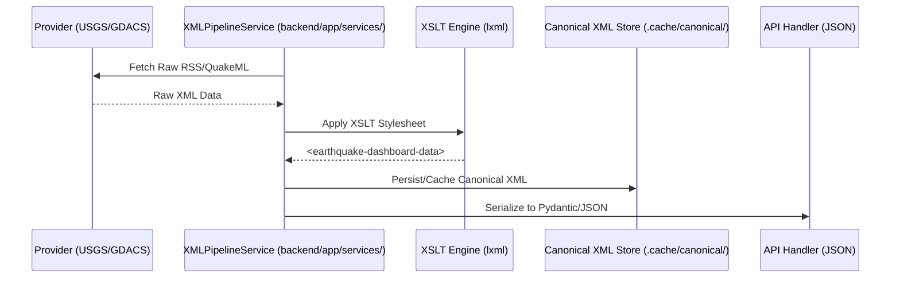

# XML Transformation Pipeline & XSLT Documentation

> [!IMPORTANT]
> **MANDATORY GRADED DELIVERABLE**
> This directory and the underlying XSLT pipeline are core architectural components of the Global Earthquake Monitor. The data flow MUST explicitly pass through these transformations to satisfy the "Canonical XML Intermediate" requirement.

## Architectural Overview

The backend uses a **Canonical XML Schema** as its authoritative intermediate data representation. This ensures that the application is decoupled from specific provider formats (like USGS QuakeML or GDACS RSS) and can define its own internal data standard.

### Transformation Flow



---

## Stylesheet Ledger

| Stylesheet | Responsibility | Input Format | Output Stage |
| :--- | :--- | :--- | :--- |
| **`usgs_to_canonical.xsl`** | Transforms USGS QuakeML into the canonical schema. | USGS QuakeML (XML) | Canonical Intermediate |
| **`gdacs_to_canonical.xsl`** | Transforms GDACS RSS alerts into the canonical schema. | RSS 2.0 (Geo/GDACS XML) | Canonical Intermediate |

---

## The Canonical Schema: `<earthquake-dashboard-data>`

The canonical schema is designed to represent seismic event data in a format optimized for the dashboard's needs.

### Schema Structure (Snippet)
```xml
<earthquake-dashboard-data>
  <event>
    <id>Unique event identifier</id>
    <title>Human-readable title</title>
    <main_time>ISO8601 Timestamp</main_time>
    <magnitude>Richter value</magnitude>
    <magnitude_type>Scale type (e.g., Mw)</magnitude_type>
    <depth_km>Value in kilometers</depth_km>
    <latitude>WGS84 lat</latitude>
    <longitude>WGS84 long</longitude>
    <place>Location description</place>
    <country>Country name</country>
    <alert_level>Green/Yellow/Orange/Red</alert_level>
    <alert_score>Impact score</alert_score>
    <tsunami>0/1 indicator</tsunami>
    <source>USGS/GDACS</source>
    ...
  </event>
</earthquake-dashboard-data>
```

---

## Implementation Details

The transformation is executed in-memory within the `XMLPipelineService` using the **`lxml`** library. This approach allows for:
1.  **Strict Validation**: Input data is parsed as XML before transformation.
2.  **Auditability**: Evaluators can inspect the generated canonical XML in `backend/.cache/canonical/*.xml`.
3.  **Low Latency**: XSLT transformations are performed in-memory without disk I/O bottlenecks.

For further implementation details, see **`backend/app/services/xml_pipeline.py`**.

## Examples & Samples

To help evaluators quickly inspect the pipeline, this repository includes small, self-contained sample inputs and the resulting canonical output produced by the XSLT stylesheets.

- **USGS sample input**: [transforms/samples/usgs_sample_input.xml](transforms/samples/usgs_sample_input.xml)
- **GDACS sample input**: [transforms/samples/gdacs_sample_input.xml](transforms/samples/gdacs_sample_input.xml)
- **Sample canonical output**: [transforms/samples/usgs_canonical_sample.xml](transforms/samples/usgs_canonical_sample.xml)

Run a quick local transform using the backend pipeline (Python):

```python
from backend.app.services.xml_pipeline import XMLPipelineService

svc = XMLPipelineService(xslt_dir="transforms", cache_dir="backend/.cache")
with open("transforms/samples/usgs_sample_input.xml", "r", encoding="utf-8") as f:
  raw = f.read()

canonical = svc.apply_xslt(raw, provider="USGS")
print(canonical)
```

Audit note: the pipeline persists the latest canonical XML for each provider in `backend/.cache/canonical/` (e.g. `backend/.cache/canonical/usgs_latest.xml`). These cached files are deliberately stored so graders can inspect the transformed XML without running the service.

---

> **Reminder:** The `transforms/` directory and its XSLT stylesheets are a MANDATORY graded deliverable — do not remove or obfuscate them. Evaluators should be able to open the stylesheet files, run the sample transforms above, and review the canonical XML results.
